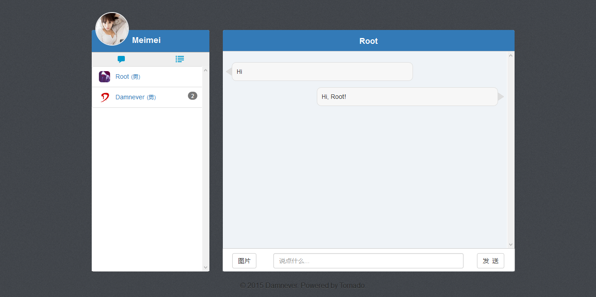

## Chat Room

Powered by Tornado, MySQL, Redis, Bootstrap, jQuery, Requests and more (To Be Continued...).

[效果预览](#result)

***

### Summary

- 基于`Redis`的简单任务队列 [taskq and doc](taskq/)，任务顺序执行，没有优先级......... 如果单独拿出来用千万要看**[README](taskq/README.md)**！！！
- `Tornado`提供`Web`后端服务，前端使用`jQuery`和`Bootstrap`（太没新意了...）。
- 用`MySQL`来存储注册用户信息、邮箱验证和密码找回的`UUID`。
- 用`Redis`存储在线用户以及聊天信息。
- 邮箱用来验证注册用户和密码找回。
- 实时上下线消息、聊天消息的推送使用长轮询（或许考虑使用 WebSocket）结合`Redis`的 Pub-Sub 功能。如果消息来自当前正在聊天的用户，直接显示，否则显示未读数；图片消息经过 JavaScript base64 编码后传送到服务端。
- 机器人功能使用 http://www.tuling123.com/openapi/cloud/access_api.jsp 的 API，这里只提供文本类消息回复，其它类型都被替换了。

### Setup

1. 项目依赖于`MySQL`和`Redis`，`mysql -u root -p < chat.sql`初始化数据库；`pip install -r requirements.txt`解决`Python 2.7.x`依赖。

2. 邮箱需要支持 SMTP，在`chat_share.conf`设置好`from_addr`（邮箱地址）、`from_pwd`（邮箱密码）和`smtp_server`（SMTP 服务器地址）；机器人需要设置`chat_share.conf`里的`robot_key`，自己申请...

3. 给`chat_share.conf`创建一个符号链接（Win 下的快捷方式）为`chat.conf`（`ln -s chat_share.conf chat.conf`）或者直接重命名。主要是这部分涉及私密信息，万一提交了就... 所以本地还有一份`chat_dev.conf`。

4. 注册登录发送邮件需要启动任务队列：`cd taskq/`（在`taskq`目录下执行）`python executor.py`，详情见[taskq](taskq/)。

5. 跑起来: `python app.py`或者`chmod +x app.py` `./app.py`。

6. 第一步 Star 然后 Clone/Download ~(@^_^@)~~

---

### TO-DO

- [x] 用户在线状态不稳定。（2015/8/13解决: 使用 Redis 的 HashTable 存储上线用户信息和一个时间戳，并在`RequestHandler().on_connection_close()`时使用`IOLoop().add_timeout()`给用户一个机会快速的重连）
- [x] 发送邮件的时候阻塞太明显了，使用任务队列？（2015/8/22解决：写了一个简单的任务队列，见：[taskq](taskq/)）
- [ ] Redis 默认异步的保存数据到本地，或许用户下线多久后自动将消息清除掉。
- [ ] 通过其它网站的 OAuth 登录？就是个简单聊天室又咋地啦？
- [ ] 邮件验证、密码找回 UUID（或者其它）失效时间？

### LICENSE

[The BSD 3-Clause License](./LICENSE)

<h3 id="result">Pictures</h3>

[Old English Version](./English.md)